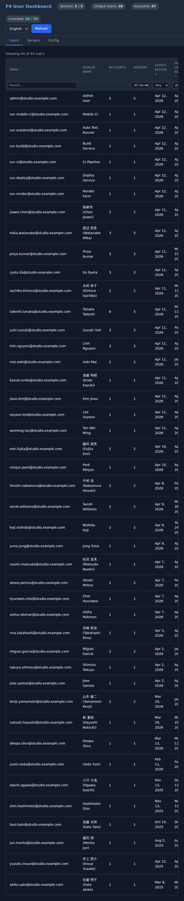

# P4 User Dashboard

**English** | [日本語](README.ja.md)

A lightweight, locally-run tool for managing Perforce users across multiple P4 servers. Built for administrators who need to audit license usage, identify inactive accounts, and manage users across large multi-server environments.



## The Problem

Large game studios and enterprises often run dozens or hundreds of P4 commit servers. Managing users across all of them is painful:

- No consolidated view — each server is its own island
- License audits require connecting to each server individually via P4Admin
- The same employee often has accounts on multiple servers, each consuming a license
- Identifying truly inactive users requires checking access times across all servers

## What This Tool Does

- **Aggregates users by email** across all configured P4 servers into a single view
- **Shows cross-server overlap** — see which users have accounts on multiple servers and how many licenses they're consuming
- **Surfaces inactive accounts** with "Latest Access" and "Oldest Access (All Accounts)" columns — the latter catches users who are active on one server but abandoned on another
- **Supports filtering and sorting** on every column, with "newer than" / "older than" date filters
- **Edit and delete** individual user accounts, with password reset for non-SSO users
- **Works with mixed environments** — automatically handles both unicode and non-unicode P4 servers
- **Japanese / English toggle** — switch the UI language without refreshing

## Quick Start

### Requirements

- Python 3.12+
- [uv](https://docs.astral.sh/uv/) (recommended) or pip
- `p4` CLI (for server management commands in the demo)
- A P4 login ticket for each server you want to manage (`p4 login`)

### Install and Run

```bash
git clone https://github.com/jase-perf/p4-user-dashboard.git
cd p4-user-dashboard

# Install dependencies
uv sync            # or: pip install -r requirements.txt

# Create a config file (see Configuration below)
cp demo/config.json my-config.json
# Edit my-config.json with your server details

# Run the dashboard
uv run python dashboard.py my-config.json
# or: python dashboard.py my-config.json
```

The dashboard starts a local web server and opens your browser. All data stays on your machine.

### Try the Demo

The repo includes a demo environment with 5 pre-configured P4 servers and realistic test data. You'll need `p4d` — the setup script can download it automatically:

```bash
# Start the demo servers (downloads p4d if needed)
bash demo/setup.sh

# Run the dashboard against the demo servers
uv run python dashboard.py demo/config.json
```

The demo includes 5 servers across Tokyo, Osaka, Nagoya, Seoul, and Singapore with ~60 user accounts (mix of Japanese, Korean, Chinese, Indian, Vietnamese, and Western names), varied access times from 1 to 400 days ago, and a mix of unicode and non-unicode servers.

```bash
# Check demo server status
bash demo/setup.sh --status

# Stop and clean up demo servers
bash demo/setup.sh --teardown
```

If you want to download `p4d` manually instead of using the auto-download, get it from [perforce.com/downloads](https://www.perforce.com/downloads/helix-core-server) and place the binary in `demo/bin/`.

## Configuration

The dashboard reads a JSON config file:

```json
{
  "port": 8181,
  "licensedUniqueUsers": 1500,
  "servers": [
    {"name": "prod-tokyo", "port": "ssl:p4-tokyo:1666", "user": "admin"},
    {"name": "dev-osaka", "port": "ssl:p4-osaka:1666", "user": "p4admin"},
    {"name": "art-nagoya", "port": "ssl:p4-nagoya:1666"}
  ]
}
```

| Field | Description |
|---|---|
| `port` | Local port for the web UI (default: 8080) |
| `licensedUniqueUsers` | Optional — your total licensed unique users for the top-bar indicator |
| `servers[].name` | Display name for the server |
| `servers[].port` | P4PORT connection string |
| `servers[].user` | P4 username (optional — defaults to system default) |

The config can also be edited from the dashboard's Config tab.

### Authentication

The dashboard uses your existing P4 login tickets — the same credentials you'd use with `p4` or P4Admin. Before connecting:

```bash
p4 -p ssl:p4-tokyo:1666 login    # Log in to each server
p4 -p ssl:p4-osaka:1666 login
```

If a server requires authentication, the dashboard shows the error and you can retry after logging in — no need to restart.

## Architecture

```
Browser (localhost)           Python Server (FastAPI)         P4 Servers
┌──────────────────┐         ┌──────────────────────┐       ┌──────────┐
│ Full dataset as  │  HTTP   │ Fetches & aggregates │ P4API │ Server A │
│ JSON — all       │◄───────►│ user data, caches    │◄─────►│ Server B │
│ filtering/sorting│         │ in memory, proxies   │       │ Server C │
│ is client-side   │         │ write operations     │       │ ...      │
└──────────────────┘         └──────────────────────┘       └──────────┘
```

- **Locally run** — binds to `0.0.0.0` for LAN access, no cloud dependency
- **No database** — fetches from P4 servers on startup/refresh, caches in memory
- **Client-side performance** — full dataset sent to browser, instant filtering/sorting even with thousands of users
- **Unicode auto-detection** — automatically handles both unicode and non-unicode P4 servers

## Development

```bash
# Install dev dependencies
uv sync

# Start demo servers for testing
bash demo/setup.sh

# Run tests
uv run pytest tests/ -v

# Stop demo servers
bash demo/setup.sh --teardown
```

## Tech Stack

- **Backend:** Python, FastAPI, P4Python, Uvicorn
- **Frontend:** Vanilla JavaScript, Tailwind CSS (CDN)
- **No build step** — no npm, no bundling, no compilation

## License

MIT
